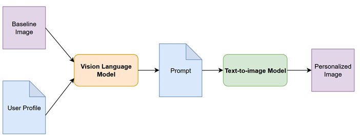

### 🚀 From Graduation Thesis to Forbes Top Graduates 2025
---
Winning an award is always special, but seeing an academic project recognized on a national level was an amazine feeling. I am beyond proud to share that my thesis in Artificial Intelligence has been selected by **Forbes Italy** as one of the **Top Graduates 2025**!

Out of thousands of graduates from all over Italy, only 100 were chosen for this prestigious recognition.

### 👜 Why Fashion?
---
My interest in this field comes from a genuine **love** for fashion. I’ve always been interested in **high fashion** and the world built around garments, runways, and **brand identity**. Houses like *Rick Owens*, *Valentino*, *Jacquemus*, *Prada*, *Margiela*, *Miu Miu* don't just make clothes; they **communicate** a complete visual **culture**, an atmosphere, and a **story**.

In standard **e-commerce**, keeping product presentations clean and objective makes total sense. The goal is to **display** the garment as **purely** as possible. However, there is a huge opportunity to push things further. That’s why I built this project:

1. As a **tool** for **creating** advertisements or even **exploring** garment concepts (much like [*Nike's A.I.R.*](https://about.nike.com/en-GB/magazine/creating-the-unreal-how-nike-made-its-wildest-air-footwear-yet) project, using AI to **push** creative boundaries).
2. As a **feature** that brands can **integrate** directly into their **e-commerce**, allowing users to see a **clothing item** styled and **customized** to their own profile **on demand**.

To learn more about fashion communication please have a loof at these amazing resources:
- [*Off White - Show Notes*](https://d3uqg2ap1kpnl9.cloudfront.net/wp-content/uploads/2022/03/01120843/SpaceshipEarth_Shownotes.pdf) *by Virgil Abloh*
- [*Free Game*](https://free---game.com/) *by Virgil Abloh*
- [*A Manifesto According to Virgil Abloh*](https://d3uqg2ap1kpnl9.cloudfront.net/wp-content/uploads/2020/08/13111013/5.pdf) *by Virgil Abloh*
- [*The Business of Aspiration*](https://www.academia.edu/125121876/The_Business_of_Aspiration) *by Ana Andjelic*

### ⚖️ Ethics
---
This should always act as a support system, **never** as a replacement for **human creativity** and **craftsmanship**. The goal of this project isn't to take the human element out of fashion, but to give designers and creators powerful tools to **enhance** their work and **present it better**.

*More on this topic on my thesis paper.*

### 💡 The Project: AI-Powered Personalized Advertising
---
By combining an individual user’s profile with a specific piece of clothing, the system leverages advanced AI architectures to create custom, **tailored advertisements**, drastically **elevating** product **presentation** and **personalization**.

As demonstrated during testing, the vast majority of users showed a strong **preference for the personalized generated images**, stating they would feel much **more inclined to buy** clothes when presented this way.

### ⚙️ Key Technical Features
---
<figure style="text-align: center; margin-bottom: 0px;">
  
  <figcaption style="font-style: italic; margin-top: 2px;">Project Pipeline</figcaption>
</figure>

- **VLM (Vision-Language Models)** — Integrated to bridge visual and textual data, ensuring seamless alignment between the user profile, the garment, and the generated adv.
- **LDM (Latent Diffusion Models)** — Used to create high-quality, context-aware visuals tailored to individual user preferences.
- **Performance Monitoring Dashboard** — A dedicated section built into the platform to track, analyze, and optimize generation metrics and performance in real-time.

---
*If you are interested in diving deeper into the technical details, feel free to visit the GitHub repository where you can inspect the code or read my complete PDF thesis!*